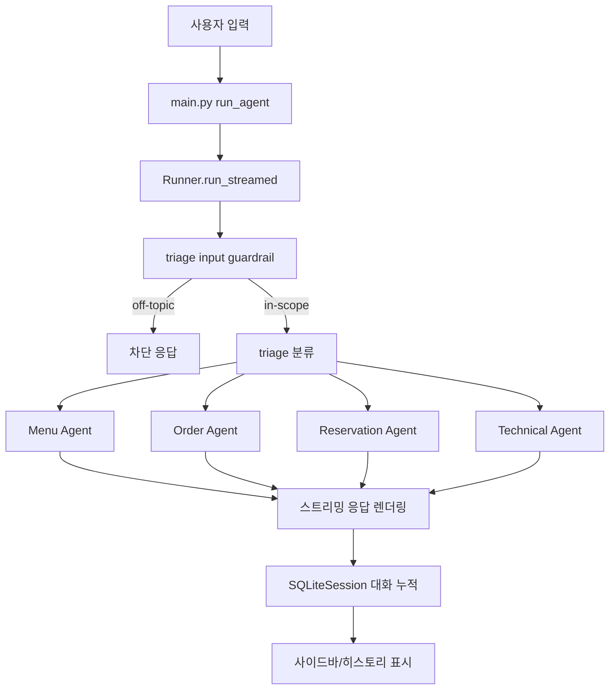

# Restaurant Bot 프로젝트 플로우

## 1) 전체 아키텍처 요약

이 프로젝트는 Streamlit 기반 멀티 에이전트 고객지원 봇입니다.

- 진입점: main.py
- 라우팅 허브: my_agents/triage_agent.py
- 도메인 전문 에이전트:
	- 메뉴: my_agents/Menu_Agent.py
	- 주문: my_agents/Order_Agent.py
	- 예약: my_agents/Reservation_Agent.py
	- 기술지원: my_agents/technical_agent.py
- 데이터 모델: models.py
- 출력 가드레일(정의): output_guardrails.py

## 2) 런타임 처리 흐름

1. 앱 시작
- main.py에서 .env 로드 후 OPENAI_API_KEY 존재 여부 확인
- 사용자 컨텍스트(UserAccountContext) 생성
- 세션 상태에 triage agent/SQLiteSession이 없으면 초기화

2. 히스토리/입력 준비
- SQLiteSession("chat-history", "chat-gpt-clone-memory.db")에 대화 저장
- API 키가 없으면 입력창 비활성화, 안내 메시지 출력

3. 사용자 입력 수신
- 사용자가 메시지를 입력하면 run_agent(message) 실행
- Runner.run_streamed(...)로 스트리밍 응답 시작

4. 입력 가드레일 검사
- triage_agent의 input_guardrail(off_topic_guardrail) 동작
- 메뉴/예약/주문/기술지원 범위를 벗어나면 tripwire로 차단

5. 트리아지 분류 및 핸드오프
- triage agent가 이슈를 4개 도메인 중 하나로 분류
- handoff를 통해 해당 전문 에이전트로 라우팅
- 라우팅 사유/이슈 타입/세부내용은 사이드바에 표시

6. 전문 에이전트 응답
- 전문 에이전트가 컨텍스트(이름, 티어)를 반영해 답변 생성
- 스트리밍 토큰을 UI에 실시간 렌더링

7. 에이전트 전환 이벤트 처리
- agent_update_stream_event 수신 시 현재 agent를 새 agent로 갱신
- 이후 응답은 갱신된 에이전트 기준으로 계속 진행

8. 예외 처리
- InputGuardrailTripwireTriggered 발생 시 "실행할 수 없습니다." 출력
- 기타 예외 발생 시 에러 메시지 출력

## 3) 시각적 플로우 (Mermaid)

## 4) 에이전트별 책임 범위

- Triage Agent
	- 사용자 의도를 분류하고 적절한 전문 에이전트로 라우팅
	- 입력 가드레일로 오프토픽 요청 차단

- Menu Agent
	- 메뉴 추천, 재료/알레르기, 식이 제한, 대체 메뉴 안내

- Order Management Agent
	- 주문 상태, 변경/취소, 누락/오배송 이슈 처리

- Reservation Agent
	- 예약 생성/변경/취소, 대기열/좌석 요청 처리

- Technical Support Agent
	- 앱/웹 오류, 성능, 로그인 등 기술 문의 처리

## 5) 가드레일 정리

- 입력 가드레일(실사용)
	- 위치: my_agents/triage_agent.py
	- 목적: 도메인 외 요청 차단

- 출력 가드레일(현재 정의만 되어 있음)
	- 위치: output_guardrails.py
	- 목적: 기술지원 답변에 주문/결제/계정 관리 정보가 섞이는지 점검
	- 참고: 현재 technical_agent에 연결되어 있지 않아 런타임에서 자동 적용되지는 않음

## 6) 상태 저장 및 UI 포인트

- 상태 저장
	- st.session_state["agent"]: 현재 활성 에이전트
	- st.session_state["session"]: SQLite 대화 세션

- UI 포인트
	- 채팅 영역: 사용자/AI 메시지 스트리밍 표시
	- 사이드바: 핸드오프 정보, Reset Conversation 버튼, 현재 히스토리 확인

## 7) 한 줄 요약

사용자 입력을 triage agent가 안전하게 분류하고, 전문 에이전트로 핸드오프하여 스트리밍 응답을 제공하며, 전체 대화는 SQLite 세션에 누적 저장되는 구조입니다.
